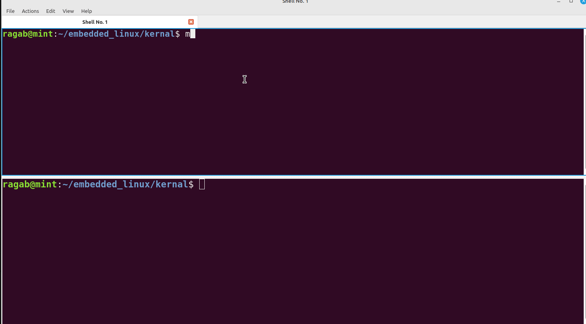
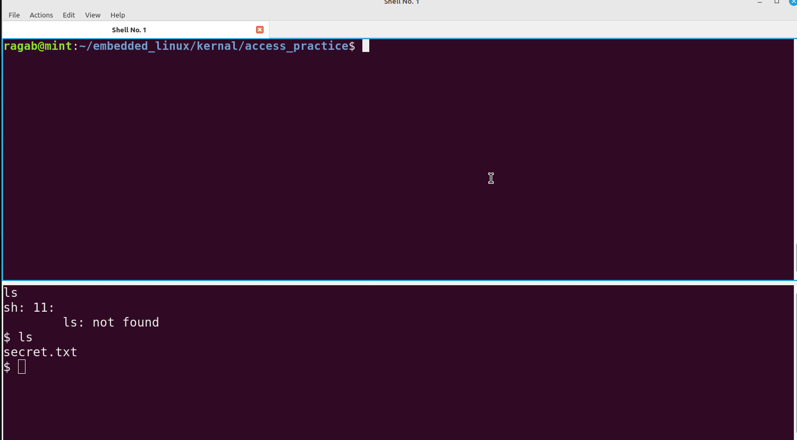

# Task: Ownership and Resources Management

## Exercise 1: File Permissions and Ownership

1. Create a directory called `access_practice`.
2. Inside the directory, create a file named `secret.txt`.
3. Set the file permissions to allow read and write access for the owner, and no access for the group and others.
4. Change the ownership of the file to a different user.
5. Try accessing the file from both the original and the different user accounts to observe the access permissions in action.

## Exercise 2: User and Group Management

1. Create a new user named `user1`.
2. Create a new group named `group1`.
3. Add `user1` to `group1`.

4. Change the ownership of `secret.txt` to `user1` and `group1`.
5. Set the file permissions to allow read and write access for the owner and the group.
6. Test accessing the file both as `user1` and a different user to understand group-based access control.
