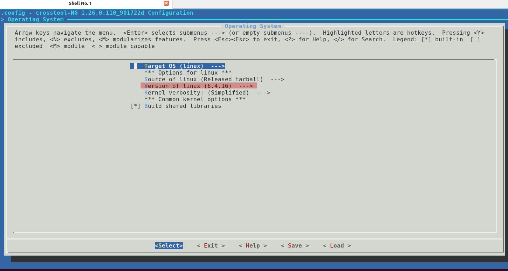
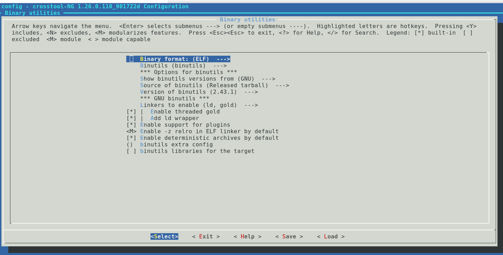

# Crosstool-NG for Generate  Raspberry Pi 3 Toolchain

# **1. Setting Up the Toolchain**

Before diving into cross-compilation, let's ensure you have the necessary prerequisites. Run the following commands to install essential tools:

```bash
sudo apt-get install autoconf automake bison bzip2 cmake flex g++ gawk gcc gettext git gperf help2man libncurses5-dev libstdc++6 libtool libtool-bin make patch python3-dev rsync texinfo unzip wget xz-utils

```

Now, let's clone the **crosstool**-NG repository, configure, build, and install it:

```bash
git clone https://github.com/crosstool-ng/crosstool-ng.git
cd crosstool-ng
./bootstrap
 ./configure --prefix=${PWD}
make
make install
```

# **2. Finding and Building a Toolchain**

# **2.1 Delete the old Toolchain**

You can delete the script, log, dir folder, .config file  by using 

```bash
bin/ct-ng distclean

```

**output:**

```bash
  CLEAN scripts
  CLEAN log
  CLEAN build dir
  CLEAN .config
```

# **2.2 list all Toolchain to Choose *aarch64-rpi3-linux-gnu***

Now we list all **Toolchain** that cross-tool-NG support it , to build

```bash
bin/ct-ng list-samples
```

**output:**

```bash
Status  Sample name
[L...]   aarch64-ol7u9-linux-gnu
[L...]   aarch64-ol8u6-linux-gnu
[L...]   aarch64-ol8u7-linux-gnu
[L...]   aarch64-ol8u8-linux-gnu
[L...]   aarch64-ol9u2-linux-gnu
***[L...]   aarch64-rpi3-linux-gnu***
[L...]   aarch64-rpi4-linux-gnu
[L...]   aarch64-unknown-linux-gnu
[L...]   aarch64-unknown-linux-musl
[L...]   aarch64-unknown-linux-uclibc
[L...]   alphaev56-unknown-linux-gnu
[L...]   alphaev67-unknown-linux-gnu
[L...]   arc-arc700-linux-uclibc
[L...]   arc-archs-linux-gnu
[L...]   arc-multilib-elf32
[L...]   arc-multilib-linux-gnu
[L...]   arc-multilib-linux-uclibc
...........
```

# **2.3** choose <sample> **all *aarch64-rpi3-linux-gnu* Toolchain**

Now we use these commands to select Toolchain, and then the .config file generated 

```bash
bin/ct-ng aarch64-rpi3-linux-gnu
```

**output:**

```bash
  CONF  aarch64-rpi3-linux-gnu
#
# configuration written to .config
#

***********************************************************

Initially reported by: Bryan Hundven
URL: 

Comment:
Raspberry PI 3 aarch64

***********************************************************

Now configured for "aarch64-rpi3-linux-gnu"

```

# **2.4 use the menuconfig to set the configuration for  *aarch64-rpi3-linux-gnu* Toolchain**

Now we use these commands to set **configuration** for  the  Toolchain, and then the .config file generated 

```bash
bin/ct-ng aarch64-rpi3-linux-gnu

```

- menuconfig:


- Toolchain Options :


- Operating System Options:
    - Linux kernel version: 6.4.16



- Binary utility Options:



- C library Options:


- C compiler Options:


- Debug facilities Options


- Companion Tools Options


**output:**

```bash
  CONF  menuconfig

*** End of the configuration.
*** Execute 'ct-ng build' to start the build or try 'ct-ng help'.
```

# **2.5 Build the Toolchain *aarch64-rpi3-linux-gnu***

Now we use these commands to select Toolchain, and then the .config file generated 

```bash
bin/ct-ng build
bin/ct-ng build.numberofcores -1
```


**output:**

```bash
[INFO ]  =================================================================
[INFO ]  Installing strace
[EXTRA]    Configuring strace
[EXTRA]    Building strace
[EXTRA]    Installing strace
[INFO ]  Installing strace: done in 46.14s (at 44:39)
[INFO ]  =================================================================
[INFO ]  Finalizing the toolchain's directory
[INFO ]    Stripping all toolchain executables
[EXTRA]    Installing the populate helper
[EXTRA]    Installing a cross-ldd helper
[EXTRA]    Creating toolchain aliases
[EXTRA]    Removing installed documentation
[EXTRA]    Collect license information from: **/media/ragab/2e6aa1be-2f37-440f-9a02-a6118b45e071/manual/crosstool-ng/.build/aarch64-rpi3-linux-gnu/**src
[EXTRA]    Put the license information to: /home/ragab/x-tools/aarch64-rpi3-linux-gnu/share/licenses
[INFO ]  Finalizing the toolchain's directory: done in 12.65s (at 44:52)
[INFO ]  Build completed at 20240905.000507
[INFO ]  (elapsed: 44:50.96)
[INFO ]  Finishing installation (may take a few seconds)...

```

- this is the directive of the generated Toolchain: ~/x-tools/


# **3. Understanding the Toolchain**

The toolchain comprises various components, including static and dynamic libraries. Understanding these components is crucial for effective cross-compilation.

- this is the cross Toolchain (Host)

```bash
ragab@mint:~/x-tools$ ls /home/ragab/x-tools/aarch64-rpi3-linux-gnu/bin
aarch64-rpi3-linux-gnu-addr2line   aarch64-rpi3-linux-gnu-gcc-ranlib       aarch64-rpi3-linux-gnu-ld.bfd    aclocal-1.16
aarch64-rpi3-linux-gnu-ar          aarch64-rpi3-linux-gnu-gcov             aarch64-rpi3-linux-gnu-ldd       autoconf
aarch64-rpi3-linux-gnu-as          aarch64-rpi3-linux-gnu-gcov-dump        aarch64-rpi3-linux-gnu-ld.gold   autoheader
aarch64-rpi3-linux-gnu-c++         aarch64-rpi3-linux-gnu-gcov-tool        aarch64-rpi3-linux-gnu-lto-dump  autom4te
aarch64-rpi3-linux-gnu-cc          aarch64-rpi3-linux-gnu-gdb              aarch64-rpi3-linux-gnu-nm        automake
aarch64-rpi3-linux-gnu-c++filt     aarch64-rpi3-linux-gnu-gdb-add-index    aarch64-rpi3-linux-gnu-objcopy   automake-1.16
aarch64-rpi3-linux-gnu-cpp         aarch64-rpi3-linux-gnu-gp-archive       aarch64-rpi3-linux-gnu-objdump   autoreconf
aarch64-rpi3-linux-gnu-dwp         aarch64-rpi3-linux-gnu-gp-collect-app   aarch64-rpi3-linux-gnu-populate  autoscan
aarch64-rpi3-linux-gnu-elfedit     aarch64-rpi3-linux-gnu-gp-display-html  aarch64-rpi3-linux-gnu-ranlib    autoupdate
aarch64-rpi3-linux-gnu-g++         aarch64-rpi3-linux-gnu-gp-display-src   aarch64-rpi3-linux-gnu-readelf   ifnames
aarch64-rpi3-linux-gnu-gcc         aarch64-rpi3-linux-gnu-gp-display-text  aarch64-rpi3-linux-gnu-size      m4
aarch64-rpi3-linux-gnu-gcc-11.5.0  aarch64-rpi3-linux-gnu-gprof            aarch64-rpi3-linux-gnu-strings   make
aarch64-rpi3-linux-gnu-gcc-ar      aarch64-rpi3-linux-gnu-gprofng          aarch64-rpi3-linux-gnu-strip
aarch64-rpi3-linux-gnu-gcc-nm      aarch64-rpi3-linux-gnu-ld               aclocal
ragab@mint:~/x-tools$ ls 

```


- this is the native Toolchain (Target)

```bash
ragab@mint:~/x-tools$ ls /home/ragab/x-tools/aarch64-rpi3-linux-gnu/aarch64-rpi3-linux-gnu/bin/ -ll
total 23896
-r-xr-xr-x 2 ragab ragab 1516936 Sep  5 00:04 ar
-r-xr-xr-x 2 ragab ragab 3090416 Sep  5 00:04 as
-r-xr-xr-x 1 ragab ragab     143 Sep  4 23:32 ld
-r-xr-xr-x 2 ragab ragab 3802800 Sep  5 00:04 ld.bfd
-r-xr-xr-x 2 ragab ragab 5246616 Sep  5 00:04 ld.gold
-r-xr-xr-x 2 ragab ragab 1505600 Sep  5 00:04 nm
-r-xr-xr-x 2 ragab ragab 1635784 Sep  5 00:04 objcopy
-r-xr-xr-x 2 ragab ragab 3409576 Sep  5 00:04 objdump
-r-xr-xr-x 2 ragab ragab 1516968 Sep  5 00:04 ranlib
-r-xr-xr-x 2 ragab ragab 1071976 Sep  5 00:04 readelf
-r-xr-xr-x 2 ragab ragab 1635784 Sep  5 00:04 strip
ragab@mint:~/x-tools$ 

```
