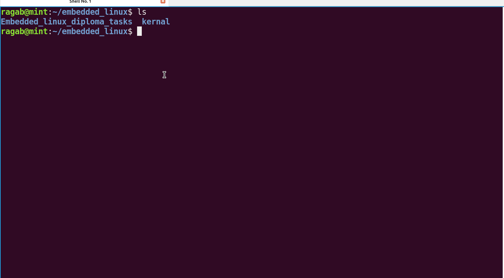
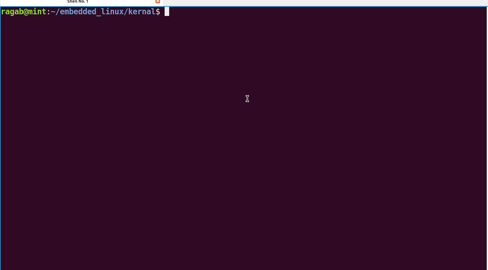
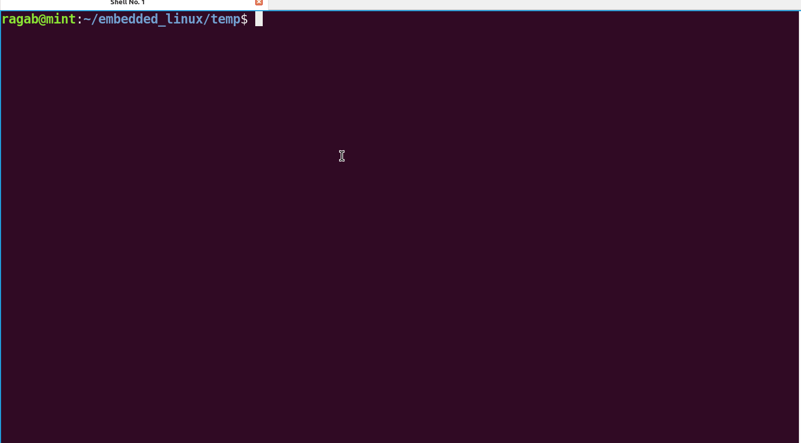
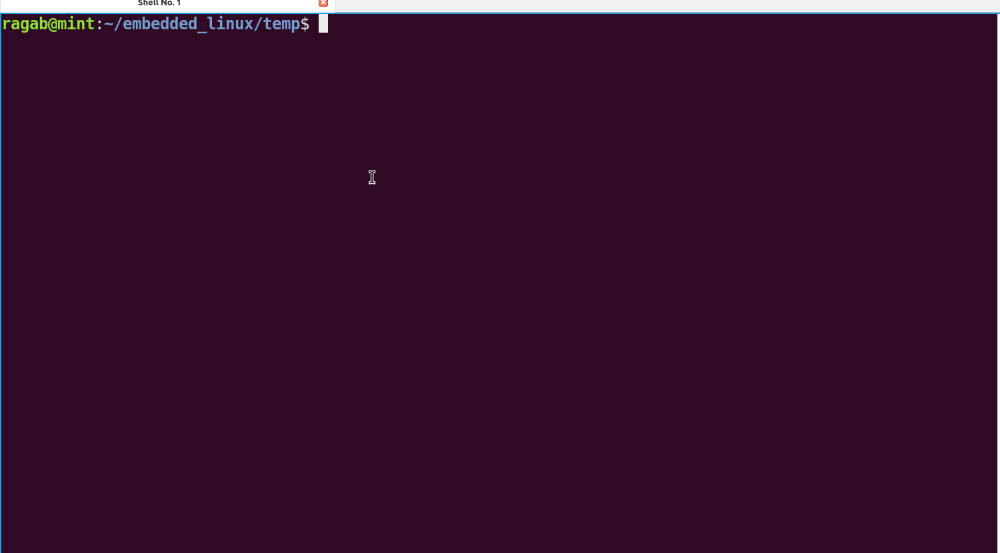
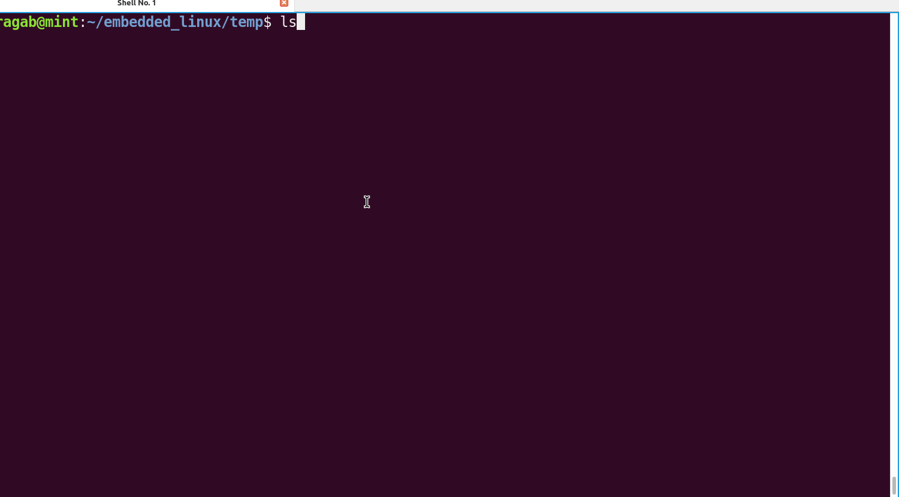

# Task (A)
## commands-fs

### Exercise 1: Basic Navigation
- Use `ls` to list all files and directories in the current directory.
- Use `cd` to navigate to a specific directory.
- Use `pwd` to print the current working directory.

### Exercise 2: File and Directory Operations
- Create a directory named "practice" in the current directory using `mkdir`.
- Create an empty file named "file.txt" within the "practice" directory using `touch`.
- Copy "file.txt" to a new file "file_backup.txt" using `cp`.
- Move "file_backup.txt" to another directory using `mv`.
- Rename "file.txt" to "new_file.txt" using `mv`.
- Delete the "new_file.txt" using `rm`.

### Exercise 3: File Viewing and Editing
- Create a text file using `echo` or a text editor like `nano`.
- View the contents of the file using `cat`.
- View the contents of the file using `less`.
- Edit the file using `nano` or another text editor.
- Redirect the output of a command (e.g., `ls`) to a file using `>`.

### Exercise 4: File Permissions
- Create a file and set specific permissions using `chmod`.
- Check the permissions of the file using `ls -l`.
- Change the owner and group of the file using `chown`.
- Verify the changes using `ls -l`.

### Exercise 5: User and Group Management
- Create a new user using `useradd`.
- Set a password for the new user using `passwd`.
- Create a new group using `groupadd`.
- Add the user to the newly created group using `usermod`.

### Exercise 6: Process Management
- List all processes using `ps`.
- List processes in real-time using `top`.
- Find a specific process using `pgrep`.
- Terminate a process using `kill`.

### Exercise 7: File Searching
- Use `find` to search for a specific file or directory.
- Use `grep` to search for a specific string in a file.

### Exercise 8: Archiving and Compression
- Create a tar archive of a directory using `tar`.
- Compress the tar archive using `gzip`.
- Extract the tar archive using `tar`.

### Exercise 9: Networking
- Ping a website or IP address using `ping`.
- Check your network interfaces and their configurations using `ifconfig` or `ip`.
- List all open ports using `netstat`.

### Exercise 10: Package Management
- Update the package list using the package manager (e.g., `apt update`).
- Install a package using the package manager (e.g., `apt install`).
- Remove a package using the package manager (e.g., `apt remove`).

### Exercise 11: File Permissions and Ownership
- Create a file and set specific permissions using `chmod`.
- Check the permissions of the file using `ls -l`.
- Change the owner and group of the file using `chown`.
- Verify the changes using `ls -l`.

### Exercise 12: Text Processing
- Use `sed` to replace a specific word in a text file.
- Use `awk` to extract specific columns from a CSV file.
- Use `grep` to find lines in a file that match a specific pattern.

