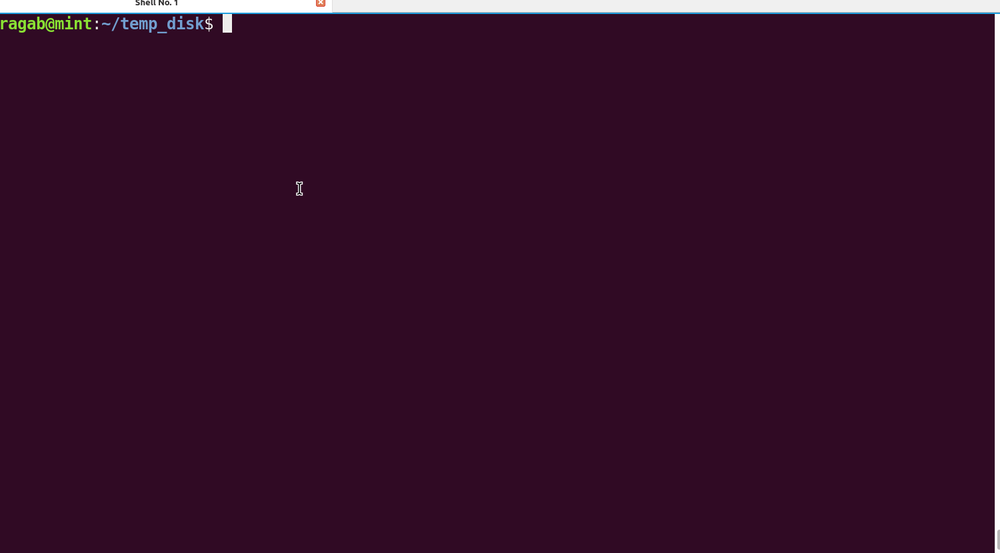
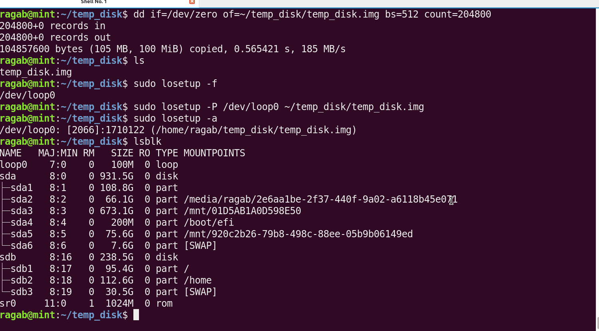
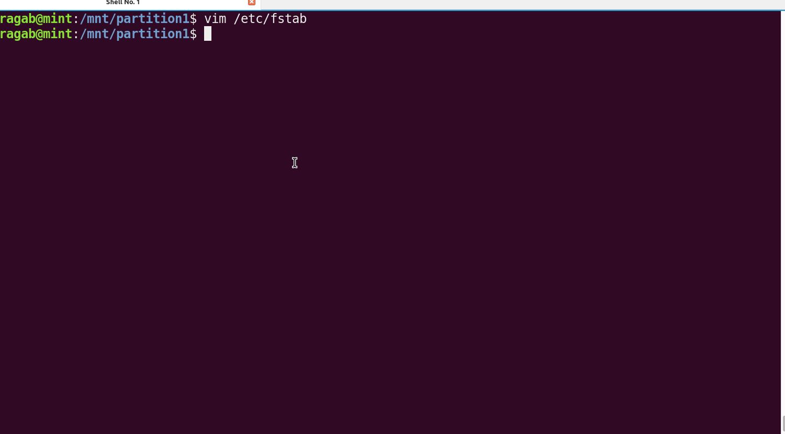

# Task (B)

## Software Needed
- `gparted`

## Requirements
1. Make at least two partitions on your SD-CARD using `gparted`.
2. Create a filesystem on each partition:
   - First partition: `ext4`
   - Second partition: `ext2`
3. Mount both partitions on your root filesystem.
4. Add some files inside each partition.
5. Reboot your machine.
6. Check if the mounting points still exist; they should not.
7. Make the `ext4` partition persistent by adding an entry to `/etc/fstab` (search how to do this).
8. Reboot your system.
9. Check if the `ext4` partition is mounted.

### Visualization and Steps

- **Temporary Disk Creation for Testing**

- **Create Partitions and Mount Filesystems**

- **Auto-Mount and Persistent Configuration**

