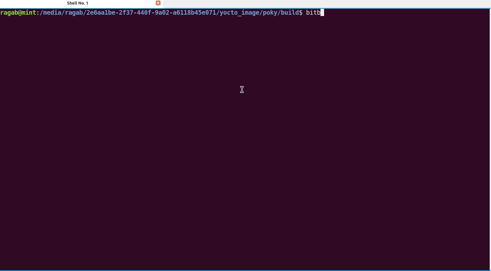
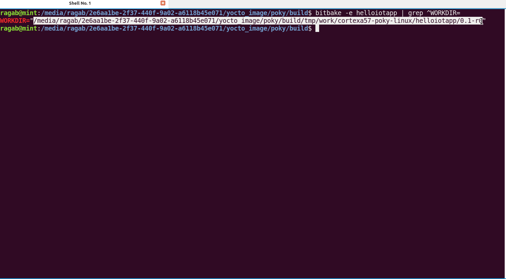
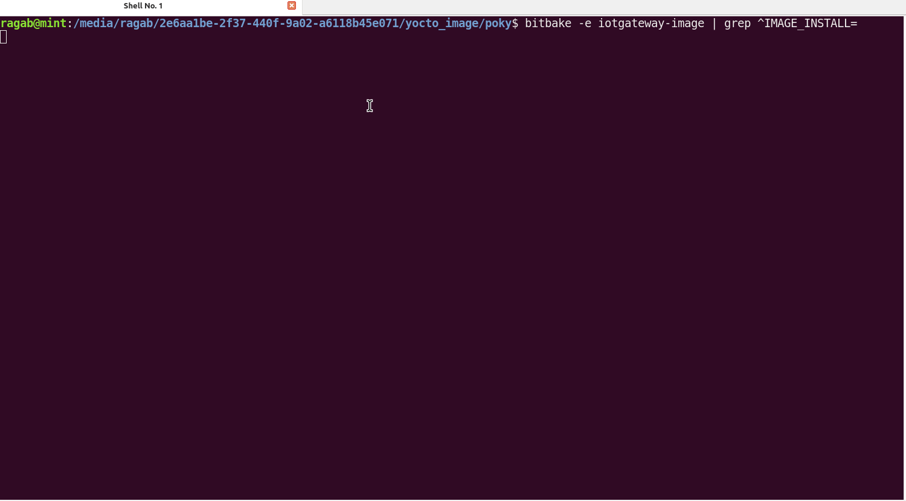
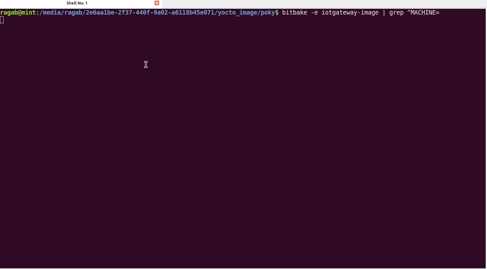
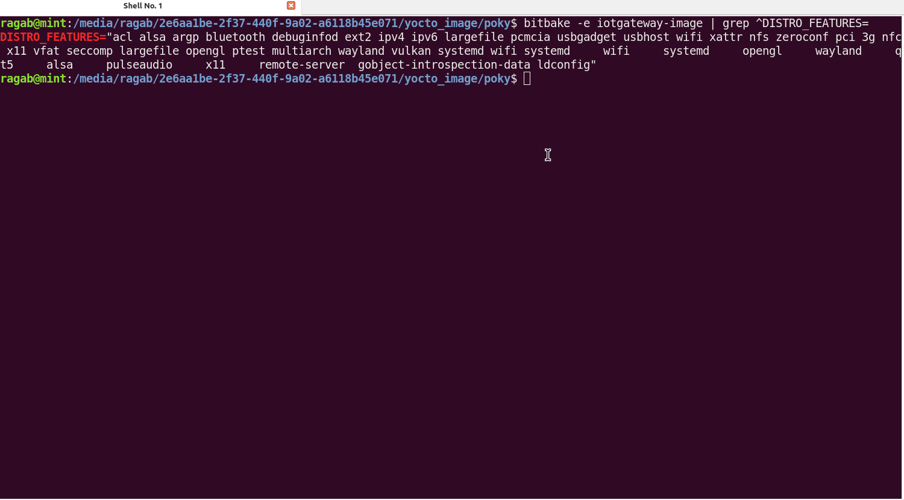
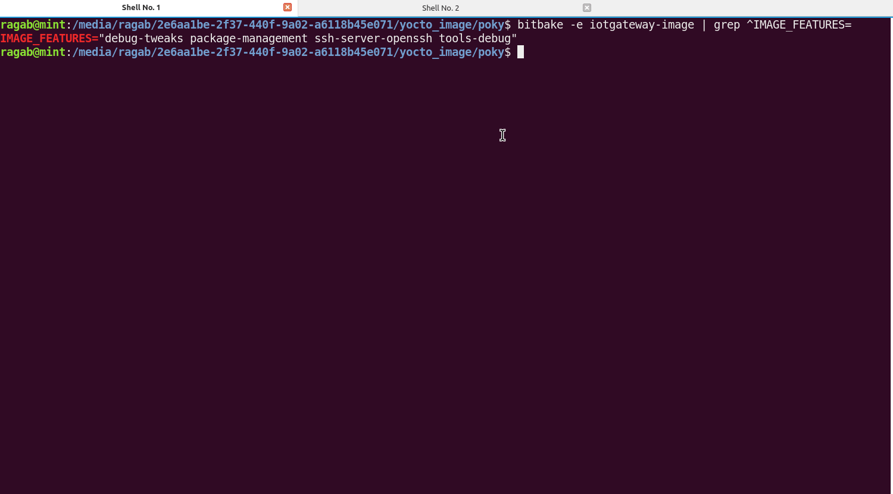
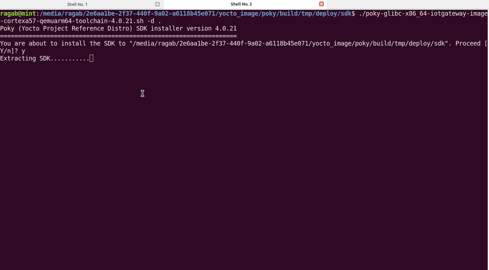
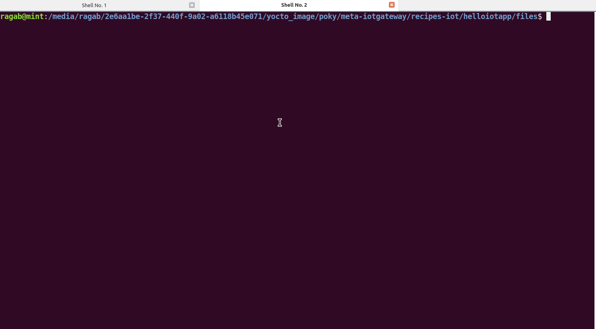

---

# IoT Gateway Yocto Project


This project demonstrates creating a secure IoT application using Yocto, OpenSSL, and QEMU. The following tasks outline the steps to build a custom Yocto image that includes the `HelloIoTApp`, a simple application demonstrating secure communication between devices.

---

## Project Tasks:

---

### Task 1: Create a New Yocto Layer
#### Objective: 
Create a new Yocto layer named `meta-iotgateway` to organize and manage custom recipes and configurations.

- **Steps:**
1. **Set Up Yocto Environment**:
   - Download and set up the Yocto Project (e.g., Poky).
   - Initialize your Yocto build environment:
     ```bash
     source oe-init-build-env
     ```

2. **Create the Layer**:
   - Use the `bitbake-layers` command to create the `meta-iotgateway` layer.
     ```bash
     bitbake-layers create-layer meta-iotgateway
     ```
   - Define your layer dependencies, e.g., for Qt5, OpenGL, and VSOMEIP, by adding the appropriate entries in the `conf/layer.conf` file of `meta-iotgateway`.



---

### Task 2: Develop Recipes for Core Packages and Applications
#### Objective: 
Write and configure recipes for the required packages, including `HelloIoTApp`.

- **Steps:**
  1. Create a recipe for `HelloIoTApp` under `recipes-iot/helloiotapp/`.
  2. Ensure the recipe installs `server.crt` and `server.key` for SSL functionality.
```bash
# Generate a private key
openssl genrsa -out server.key 2048

# Generate a self-signed certificate using the private key
openssl req -new -x509 -key server.key -out server.crt -days 365
```
  3. Use the following code  snippet`helloiotapp.cpp`:
```c++
#include <openssl/ssl.h>
#include <openssl/err.h>
#include <iostream>
#include <string.h>
#include <unistd.h>
#include <arpa/inet.h>

class HelloIoTApp {
public:
    void run() {
        SSL_library_init();
        SSL_CTX* ctx = SSL_CTX_new(TLS_server_method());
        if (!ctx) {
            std::cerr << "Unable to create SSL context" << std::endl;
            ERR_print_errors_fp(stderr);
            return;
        }

        // Load server certificate and private key
        if (SSL_CTX_use_certificate_file(ctx, "/etc/ssl/certs/server.crt", SSL_FILETYPE_PEM) <= 0) {
            ERR_print_errors_fp(stderr);
            return;
        }

        if (SSL_CTX_use_PrivateKey_file(ctx, "/etc/ssl/private/server.key", SSL_FILETYPE_PEM) <= 0) {
            ERR_print_errors_fp(stderr);
            return;
        }

        int server_fd = socket(AF_INET, SOCK_STREAM, 0);
        struct sockaddr_in addr;
        addr.sin_family = AF_INET;
        addr.sin_port = htons(4433); // Use your preferred port
        addr.sin_addr.s_addr = inet_addr("127.0.0.1"); // Listen on localhost

        if (bind(server_fd, (struct sockaddr*)&addr, sizeof(addr)) < 0) {
            perror("Bind failed");
            return;
        }

        listen(server_fd, 1);

        std::cout << "HelloIoTApp is running on localhost... Waiting for connections..." << std::endl;

        while (true) {
            int client_fd = accept(server_fd, NULL, NULL);
            if (client_fd < 0) {
                perror("Accept failed");
                continue;
            }

            SSL* ssl = SSL_new(ctx);
            SSL_set_fd(ssl, client_fd);

            if (SSL_accept(ssl) <= 0) {
                ERR_print_errors_fp(stderr);
            } else {
                std::cout << "Secure connection established!" << std::endl;

                // Send a message to the client
                const char* msg = "Hello from the server!";
                SSL_write(ssl, msg, strlen(msg)); // Send the message to the client
                std::cout << "Message sent to client: " << msg << std::endl;
            }

            SSL_shutdown(ssl);
            SSL_free(ssl);
            close(client_fd);
        }

        SSL_CTX_free(ctx);
    }
};

int main() {
    HelloIoTApp app;
    app.run();
    return 0;
}

```
  4. Use the following recipe snippet`helloiotapp_0.1.bb`:

```bash
SUMMARY = "Hello IoT Application"
DESCRIPTION = "A simple application demonstrating secure IoT communication using OpenSSL."
LICENSE = "MIT"
LIC_FILES_CHKSUM = "file://${COMMON_LICENSE_DIR}/MIT;md5=0835ade698e0bcf8506ecda2f7b4f302"

DEPENDS = "openssl"

SRC_URI = "file://helloiotapp.cpp \
            file://server.crt \
            file://server.key \
            "

S = "${WORKDIR}"

do_compile() {
    ${CXX} ${CXXFLAGS} ${LDFLAGS} -o helloiotapp ${S}/helloiotapp.cpp -lssl -lcrypto
}

do_install() {
    install -d ${D}${bindir}
    install -m 0755 helloiotapp ${D}${bindir}/

    install -d ${D}${sysconfdir}/ssl/certs
    install -m 0644 server.crt ${D}${sysconfdir}/ssl/certs/

    install -d ${D}${sysconfdir}/ssl/private
    install -m 0600 server.key ${D}${sysconfdir}/ssl/private/
}

FILES_${PN} += "${sysconfdir}/ssl/certs/server.crt"
FILES_${PN} += "${sysconfdir}/ssl/private/server.key"
```

- Files installed:
  - `/etc/ssl/certs/server.crt`
  - `/etc/ssl/private/server.key`



---

### Task 3: Customize the Image
#### Objective: 
Create a custom image recipe (`iotgateway-image.bb`) that integrates all necessary packages and applications. Alternatively, use `core-image-minimal`.

- **Steps:**
  1. Add required packages to `IMAGE_INSTALL` in the recipe.

  2. Use the following recipe snippet`bitbake iotgateway-image.bb`
```bash
# SUMMARY = "Secure IoT Gateway image"


SUMMARY = "Secure IoT Gateway image"

# Use core-image-minimal as the base
require recipes-core/images/core-image-minimal.bb

# Add necessary packages for the IoT gateway functionality
IMAGE_INSTALL:append = " \
    htop \
    iotop \
    collectd \
    nano \
    openssh \
    networkmanager \
    qtbase \
    pulseaudio \
    alsa-utils \
    openssl \
    vsomeip \
"


# Add Wi-Fi related packages for network management
IMAGE_INSTALL:append = " \
    linux-firmware \
    iw \
    wpa-supplicant \
    crda \
"

# Customize DISTRO_FEATURES to include necessary system capabilities
DISTRO_FEATURES:append = " \
    wifi \
    systemd \
    opengl \
    wayland \
    qt5 \
    alsa \
    pulseaudio \
    x11 \
    remote-server \
"


# Enable OpenSSH for SSH access
IMAGE_INSTALL:append = " \
    openssh-sftp-server \
    openssh-keygen \
"

# Optionally, specify IMAGE_FEATURES for additional functionalities
IMAGE_FEATURES:append = " \
    package-management \
    ssh-server-openssh \
    tools-debug \
    debug-tweaks \
"

# Ensure systemd is the default init system
IMAGE_INSTALL:append = " \
    systemd \
    systemd-analyze \
    systemd-compat-units \
"


# Ensure add helloiotapp to Image
IMAGE_INSTALL:append = " helloiotapp"


# Enable SSH access by ensuring SSH server is enabled at startup
SYSTEMD_AUTO_ENABLE = "enable"
```

3. Build the image using `bitbake iotgateway-image`.




---

### Task 4: Utilize Machine Features
#### Objective: 
Leverage machine features to ensure the image supports relevant hardware capabilities.

- **Steps:**
  1. Set machine-specific configurations in `build/conf/machine/local.conf`.
  ````bash
  MACHINE = "qemuarm64"
  ````
  2. Enable hardware features



---

### Task 5: Integrate Distribution Features
#### Objective: 
Customize `DISTRO_FEATURES` to tailor the distribution to specific requirements, including support for graphical frameworks and hardware acceleration.

- **Steps:**
  1. Modify `DISTRO_FEATURES` in `iotgateway-image.bb`.
  2. Add features like `x11`, `wayland`, or `opengl` as needed.

```bash
# Customize DISTRO_FEATURES to include necessary system capabilities
DISTRO_FEATURES:append = " \
    wifi \
    systemd \
    opengl \
    wayland \
    qt5 \
    alsa \
    pulseaudio \
    x11 \
    remote-server \
"
```



---

### Task 6: Implement Monitoring and Observability
#### Objective: 
Install system performance monitoring tools like `htop`, `iotop`, `cgtop`, and `collectd` to monitor your IoT application.

- **Steps:**
  1. Add monitoring tools to `IMAGE_INSTALL`.
  2. Use them to observe CPU, memory, and system performance in real time.

```bash
# Add necessary packages for the IoT gateway functionality
IMAGE_INSTALL:append = " \
    htop \
    iotop \
    collectd \
    nano \
    openssh \
    networkmanager \
    qtbase \
    pulseaudio \
    alsa-utils \
    openssl \
    vsomeip \
"
```



---

### Task 7: Testing with Yocto SDK
#### Objective: 
Compile and test the `HelloIoTApp` application using the Yocto SDK.

- **Steps:**
  1. To generate SDK.
````bash
bitbake  iotgateway-image -c populate_sdk
````

  2. Source the Yocto SDK environment.

  ````bash
  ragab@mint:/poky/build/tmp/deploy/sdk$ 
  ./poky-glibc-x86_64-iotgateway-image-cortexa57-qemuarm64-toolchain-4.0.21.sh --help
Usage: poky-glibc-x86_64-iotgateway-image-cortexa57-qemuarm64-toolchain-4.0.21.sh [-y] [-d <dir>]
  -y         Automatic yes to all prompts
  -d <dir>   Install the SDK to <dir>
======== Extensible SDK only options ============
  -n         Do not prepare the build system
  -p         Publish mode (implies -n)
======== Advanced DEBUGGING ONLY OPTIONS ========
  -S         Save relocation scripts
  -R         Do not relocate executables
  -D         use set -x to see what is going on
  -l         list files that will be extracted


agab@mint:/poky/build/tmp/deploy/sdk$ ./poky-glibc-x86_64-iotgateway-image-cortexa57-qemuarm64-toolchain-4.0.21.sh -d .
Poky (Yocto Project Reference Distro) SDK installer version 4.0.21
==================================================================
You are about to install the SDK to "/poky/build/tmp/deploy/sdk". Proceed [Y/n]? y
Extracting SDK......................................................................................................................................................................................................................................................................done
Setting it up...done
SDK has been successfully set up and is ready to be used.
Each time you wish to use the SDK in a new shell session, you need to source the environment setup script e.g.
 $ . /poky/build/tmp/deploy/sdk/environment-setup-cortexa57-poky-linux
ragab@mint:/poky/build/tmp/deploy/sdk$ ls
environment-setup-cortexa57-poky-linux
poky-glibc-x86_64-iotgateway-image-cortexa57-qemuarm64-toolchain-4.0.21.host.manifest
poky-glibc-x86_64-iotgateway-image-cortexa57-qemuarm64-toolchain-4.0.21.sh
poky-glibc-x86_64-iotgateway-image-cortexa57-qemuarm64-toolchain-4.0.21.target.manifest
poky-glibc-x86_64-iotgateway-image-cortexa57-qemuarm64-toolchain-4.0.21.testdata.json
site-config-cortexa57-poky-linux
sysroots
version-cortexa57-poky-linux


ragab@mint:/poky/build/tmp/deploy/sdk$ source environment-setup-cortexa57-poky-linux 


ragab@mint:/poky/meta-iotgateway/recipes-iot/helloiotapp/files$ env | grep CXX
CXX=aarch64-poky-linux-g++  -mcpu=cortex-a57 -march=armv8-a+crc -mbranch-protection=standard
 -fstack-protector-strong  -O2 -D_FORTIFY_SOURCE=2 -Wformat -Wformat-security -Werror=format-security 
 --sysroot=/poky/build/tmp/deploy/sdk/sysroots/cortexa57-poky-linux
CXXFLAGS= -O2 -pipe -g -feliminate-unused-debug-types 


````
  3. Compile and test the application using cross-compilation:

````bash
source /opt/poky/2.5.1/environment-setup-aarch64-poky-linux
g++ helloiotapp.cpp -o helloiotapp -lssl -lcrypto
````






---
