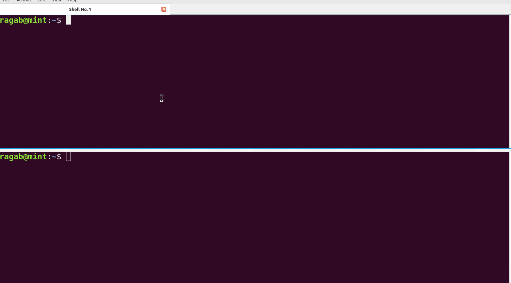
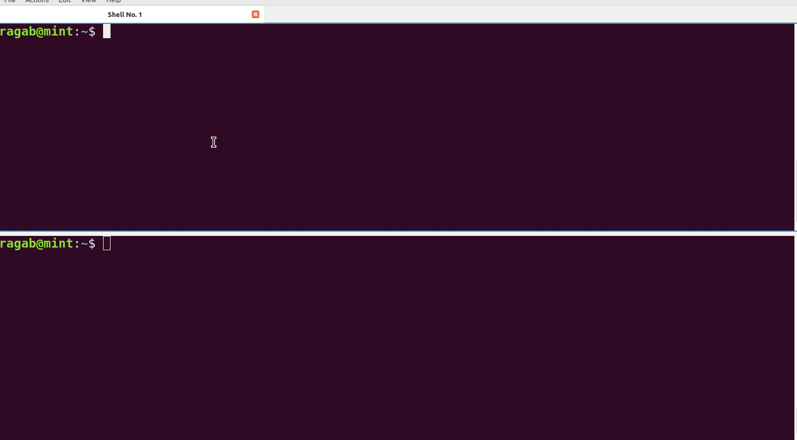

# Assignment One: Kernel Module

## 1. Check Number of Cores

To determine the number of CPU cores on your system, use the `top` command. 

## 2. 
Create number of cores + 2 processes dd if=/dev/zero of=/dev/null run in background.

Change priority for them:
-20, -10, 0, .. , 19

Monitor them using top command, did you notice any change ?

Kill them all using killall command.

